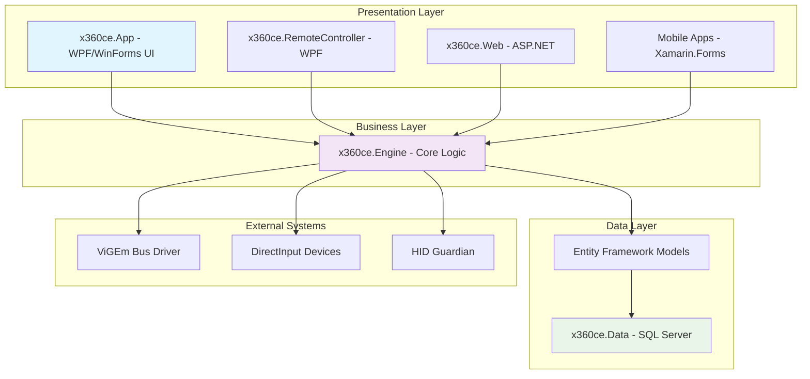
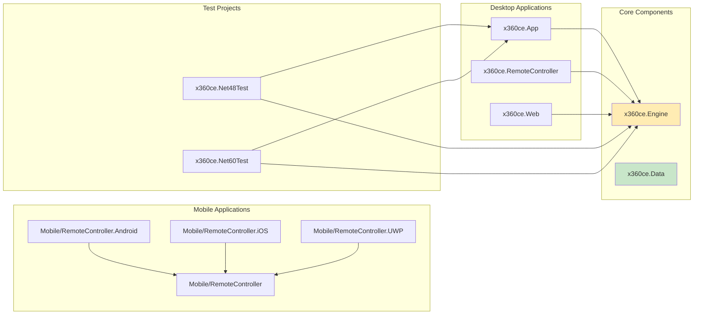
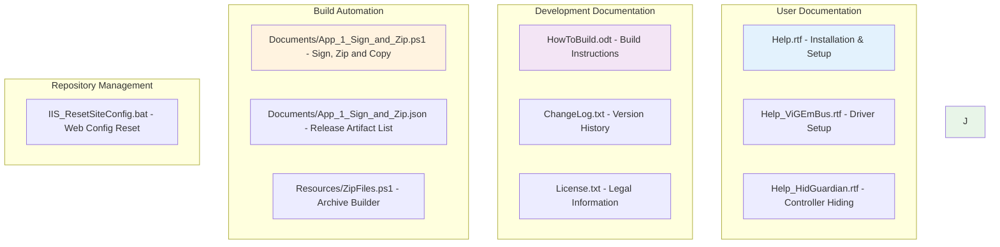

# x360ce Repository Analysis

## Project Overview

This repository contains the Xbox 360 Controller Emulator (x360ce), a comprehensive Windows application that enables various controllers (gamepads, joysticks, racing wheels) to function as Xbox 360 controllers for games that only support XInput. The project encompasses desktop applications, web services, mobile companion apps, and a complete database system for controller configuration sharing.

The project serves PC gamers who own non-Xbox controllers and need to play games that require XInput support. It provides controller mapping, configuration sharing through cloud services, and virtual gamepad emulation through the ViGEm Bus driver system.

## Technology Stack

This section documents the complete technology stack with specific versions to enable informed development decisions.

### .NET Framework Versions
- **Primary Framework**: .NET Framework 4.8 (x360ce.App, x360ce.Engine, x360ce.Web)
- **Legacy Support**: .NET Framework 4.7.2 (x360ce.RemoteController)
- **Modern Testing**: .NET 8.0 Windows (x360ce.Net60Test)
- **Cross-Platform Mobile**: .NET Standard 2.0 (Mobile shared library)

### Key Libraries and Dependencies
- **SharpDX 2.6.2**: DirectInput wrapper for controller input handling
- **ViGEm Client**: Virtual gamepad emulation driver interface
- **Entity Framework**: Database ORM for SQL Server data access
- **Xamarin.Forms 4.1.0.581479**: Cross-platform mobile UI framework
- **MSTest 3.5.0**: Unit testing framework for both .NET 4.8 and .NET 8.0

### Database Technology
- **SQL Server**: Primary database with comprehensive stored procedures
- **Entity Framework**: ORM for data access layer
- **Custom Tables**: User devices, games, settings, and cloud synchronization

### Web Technologies
- **ASP.NET Web Forms**: Legacy web application framework
- **Web Services**: ASMX-based web services for cloud functionality
- **IIS Express**: Development web server (port 20360)

### Mobile Technologies
- **Xamarin.Forms**: Shared UI layer across platforms
- **Platform-Specific**: Android v9.0, iOS, UWP 10.0.17134.0
- **Xamarin.Essentials 1.2.0**: Cross-platform device APIs

### Build Tools
- **MSBuild**: Primary build system
- **Visual Studio 2019+**: Required IDE (mobile projects reference specific paths)
- **PowerShell**: Build automation and cleanup scripts

## Architecture Overview

This section provides architectural insights crucial for understanding component relationships and system design decisions.



### Primary Architectural Pattern
The project follows a **Layered Architecture** with clear separation between presentation, business logic, and data access layers. The x360ce.Engine serves as the central business logic component shared across all presentation layers.

### Project Dependencies



### Configuration Approach
- **Desktop Apps**: app.config with ConnectionStrings and appSettings
- **Web Application**: web.config with ASP.NET membership and connection strings
- **Mobile Apps**: Platform-specific configuration and shared settings
- **Database**: Connection string management through Entity Framework

## Project Structure

This section maps the codebase organization to help developers navigate and understand component relationships.

### Core Projects

#### x360ce.App
- **Purpose**: Primary desktop application with WPF/Windows Forms hybrid UI
- **Target Framework**: .NET Framework 4.8
- **Output Type**: Windows Executable (WinExe)
- **Assembly Name**: x360ce
- **Key Features**: Controller configuration, mapping interface, cloud synchronization
- **Input Processing**: Organized input handling through InputOrchestrator and specialized processors

##### Input Processing Architecture
The x360ce.App project features a sophisticated input processing system organized into an 8-step serial execution architecture:

```
x360ce.App/Input/
├── Orchestration/           # Main coordination logic
│   ├── InputOrchestrator.cs                         # Primary orchestrator class
│   ├── InputOrchestrator.Step1.UpdateDevices.cs     # Device detection and initialization
│   ├── InputOrchestrator.Step2.LoadCapabilities.cs  # Flag-based capability loading
│   ├── InputOrchestrator.Step3.ReadDeviceStates.cs  # Raw state reading from all input methods
│   ├── InputOrchestrator.Step4.ConvertToCustomStates.cs # Convert to unified CustomDeviceState
│   ├── InputOrchestrator.Step5.UpdateXiStates.cs    # Convert CustomDeviceState to XInput
│   ├── InputOrchestrator.Step6.CombineXiStates.cs   # Combine multiple controller states
│   ├── InputOrchestrator.Step7.VirtualDevices.cs    # Update ViGEm virtual devices
│   ├── InputOrchestrator.Step8.RetrieveXiStates.cs  # Retrieve XInput controller states
│   ├── InputOrchestrator.XInputLibrary.cs           # XInput library management
│   └── InputEventArgs.cs                            # Event argument classes
└── Processors/              # Individual input method handlers
    ├── DirectInputProcessor.cs     # Microsoft DirectInput API handler
    ├── XInputProcessor.cs          # Microsoft XInput API handler
    ├── GamingInputProcessor.cs     # Windows Gaming Input API handler
    ├── RawInputProcessor.cs        # Windows Raw Input API handler
    └── IInputProcessor.cs          # Common processor interface
```

**Key Architectural Decisions:**
- **8-Step Serial Execution**: Input processing follows a clear 8-step workflow executed serially at 1000Hz for thread safety and maintainability
- **Flag-Based Capability Loading**: Capabilities are loaded only when needed using device flags (`CapabilitiesNeedLoading`, `InputMethodChanged`)
- **Orchestration Pattern**: InputOrchestrator coordinates all input processing while individual processors handle method-specific logic
- **Thread Safety**: All device operations execute in the main orchestrator thread, eliminating threading conflicts
- **Clear Data Flow**: Each step has single responsibility with predictable input/output relationships
- **Namespace Organization**: Clear separation between orchestration (`x360ce.App.Input.Orchestration`) and processing (`x360ce.App.Input.Processors`)

**8-Step Serial Execution Workflow:**
1. **Step 1 - UpdateDevices**: Device detection, enumeration, and initialization with capability loading flags
2. **Step 2 - LoadCapabilities**: Flag-based capability loading for devices that need it (initialization or input method changes)
3. **Step 3 - ReadDeviceStates**: Raw state reading from all mapped devices using their configured input methods
4. **Step 4 - ConvertToCustomStates**: Convert raw states to unified CustomDeviceState format with button analysis
5. **Step 5 - UpdateXiStates**: Convert CustomDeviceState to XInput states with mapping configuration
6. **Step 6 - CombineXiStates**: Combine multiple controller states for multi-device scenarios
7. **Step 7 - VirtualDevices**: Update ViGEm virtual devices for game compatibility
8. **Step 8 - RetrieveXiStates**: Retrieve XInput controller states for display and diagnostics

**IInputProcessor Interface Enforcement:**
All 4 processors implement identical interface with these methods:
- `InputMethod SupportedMethod { get; }` - Identifies the input method
- `bool CanProcess(UserDevice device)` - Determines device compatibility
- `CustomDeviceState ReadState(UserDevice device)` - Reads controller state
- `void HandleForceFeedback(UserDevice device, ForceFeedbackState ffState)` - Handles rumble/vibration
- `bool IsAvailable()` - Checks system availability
- `string GetDiagnosticInfo()` - Provides diagnostic information
- `ValidationResult ValidateDevice(UserDevice device)` - Validates device compatibility

**Processor-Specific Patterns:**
- **DirectInputProcessor**: Lightweight constructor, extracted constants (DefaultBufferSize=128, MouseSensitivity=16)
- **XInputProcessor**: 4-controller array initialization, organized constants (MaxControllers=4, AxisChangeThreshold=3277)
- **RawInputProcessor**: Win32 API initialization, comprehensive API constants
- **GamingInputProcessor**: Lazy initialization for optimal startup performance

##### Input Processing & UI Performance Architecture

###### Input Processing Flow
1. **High-Frequency Input Processing** (1000Hz) - `InputOrchestrator._Timer` processes all input devices at maximum rate
2. **Event Triggering** - `Global.Orchestrator.UpdateCompleted` event fires after each processing cycle
3. **UI Update Throttling** - `MainWindow.DHelper_UpdateCompleted()` (lines 615-652) limits UI updates for performance
4. **UI State Updates** - `MainWindow.UpdateForm3()` → `Global.TriggerControlUpdates()` updates all UI controls

###### UI Update Throttling (Performance Optimization)
- **File**: `x360ce.App/MainWindow.xaml.cs`, **Method**: `DHelper_UpdateCompleted()` (lines 615-652)
- **Foreground FPS**: 20Hz (`interfaceUpdateForegroundFps = 20`) - Active window gets 50ms intervals
- **Background FPS**: 5Hz (`interfaceUpdateBackgroundFps = 5`) - Inactive window gets 200ms intervals
- **Purpose**: All input processors (DirectInput/XInput/RawInput/GamingInput) use same throttling to maintain smooth interface
- **RawInput Issue**: Uses cached states from WM_INPUT message queue, causing 2-3s delay after input stops due to message buffering

## ⚠️ **CRITICAL PERFORMANCE WARNING - HIGH-FREQUENCY LOOPS**

**🚨 NEVER ADD PERFORMANCE-KILLING CODE TO INPUT PROCESSING LOOPS 🚨**

### **Input Processing Frequency**
- **Input processing runs at 1000Hz or higher** - Code in the main processing loop executes 1000+ times per second
- **Any expensive operation WILL destroy application performance**
- **Files with 1000Hz execution**: `InputOrchestrator.cs`, `RawInputProcessor.cs`, `DirectInputProcessor.cs`, `XInputProcessor.cs`, `GamingInputProcessor.cs`

### **ABSOLUTELY FORBIDDEN in High-Frequency Loops**
- ❌ **Debug.WriteLine()** - Will generate millions of debug messages per minute
- ❌ **Console.WriteLine()** - Will flood console and kill performance
- ❌ **String.Format()** or string interpolation in hot paths
- ❌ **File I/O operations** - Any file reading/writing
- ❌ **Network calls** - HTTP requests, web service calls
- ❌ **Database operations** - SQL queries, Entity Framework calls
- ❌ **Exception logging** - Try/catch with logging in hot paths
- ❌ **Thread.Sleep()** or any blocking operations
- ❌ **Memory allocations** - Large object creation in loops
- ❌ **Complex string operations** - StringBuilder, regex, etc.

### **Performance Guidelines**
- ✅ **Use conditional compilation** for debug code: `#if DEBUG`
- ✅ **Cache expensive calculations** outside the loop
- ✅ **Use primitive types** and avoid boxing/unboxing
- ✅ **Minimize object allocations** in hot paths
- ✅ **Use ref/out parameters** instead of return objects when possible
- ✅ **Pre-allocate arrays and collections** outside loops

### **Rule**: If it's called from the main input processing loop, it must be ultra-lightweight and fast

**Exception**: Slow operations are allowed in the device detection path (`UpdateDiDevices`) which runs only when new devices are connected/disconnected. This path is designed to gather complete device information, and performance is less critical here.

#### x360ce.Engine  
- **Purpose**: Core business logic library shared across all applications
- **Target Framework**: .NET Framework 4.8
- **Output Type**: Library
- **Key Components**: DirectInput handling, configuration management, data models

#### x360ce.Web
- **Purpose**: Web application for cloud services and configuration sharing
- **Target Framework**: .NET Framework 4.8
- **Technology**: ASP.NET Web Forms
- **Port**: 20360 (development)

#### x360ce.Data
- **Purpose**: SQL Server database project with schema and stored procedures
- **Database Platform**: SQL Server with compatibility level 100
- **Key Features**: User management, device configurations, game database

### Mobile Projects

#### Mobile/RemoteController
- **Purpose**: Shared Xamarin.Forms library for mobile companion apps  
- **Target Framework**: .NET Standard 2.0
- **Assembly Name**: JocysCom.RemoteController
- **Company**: Jocys.com

#### Platform-Specific Mobile Projects
- **Android**: Target Framework v9.0, Xamarin.Android support libraries 28.0.0.1
- **iOS**: Xamarin.iOS with Universal API Contract support
- **UWP**: Target Platform 10.0.17134.0 with minimum version 10.0.16299.0

### Test Projects

#### x360ce.Net48Test
- **Purpose**: Unit tests for .NET Framework 4.8 components
- **Framework**: MSTest 3.5.0
- **Features**: Memory leak testing, UI automation testing

#### x360ce.Net60Test  
- **Purpose**: Modern unit tests targeting .NET 8.0 Windows
- **Framework**: MSTest 3.5.0 with .NET Test SDK 17.10.0
- **Shared Code**: Links to .NET 4.8 test files for compatibility testing

## Development Environment Requirements

This section specifies the tools and platforms needed for development work on this codebase.

### Required Development Tools
- **Visual Studio 2019 Community** or higher (mobile projects reference specific VS2019 paths)
- **SQL Server** or SQL Server Express for database development
- **SQL Server Data Tools (SSDT)** for database project compilation
- **.NET Framework 4.8 SDK** for primary application development
- **.NET 8.0 SDK** for modern test project compilation

### Platform Requirements
- **Windows 10** or higher (required for UWP mobile development)
- **Android SDK** (for Android mobile development)
- **Xcode** (for iOS development on macOS)
- **DirectX End-User Runtime** (June 2010) for SharpDX functionality
- **Visual C++ Redistributable 2013** (both x86 and x64 on 64-bit systems)

### Optional Development Tools
- **Xamarin** workload in Visual Studio (for mobile development)
- **PowerShell 5.0+** (for build automation scripts)
- **IIS Express** (included with Visual Studio for web development)

### External Dependencies
- **ViGEm Bus Driver**: Virtual gamepad emulation system
- **HID Guardian**: Optional controller hiding functionality
- **SharpDX Libraries**: DirectInput wrapper assemblies

## Terminal Environment & Command Syntax

### PowerShell Environment
- **PowerShell Version**: 7.5.1 Core
- **Edition**: Core  
- **Operating System**: Microsoft Windows 10.0.26100 (Windows 11)
- **Platform**: Win32NT
- **Default Shell**: C:\Program Files\PowerShell\7\pwsh.exe

### Command Chaining Syntax
In PowerShell environments, use the semicolon (`;`) for sequential command execution instead of double ampersands (`&&`).

**Correct PowerShell Syntax:**
```powershell
cd x360ce.App; dotnet build x360ce.App.csproj
```

**Incorrect Syntax (avoid):**
```powershell
cd x360ce.App && dotnet build x360ce.App.csproj
```

### Build Commands for x360ce Projects
When building individual x360ce projects, use this pattern:
```powershell
cd {PROJECT_DIRECTORY}; dotnet build {PROJECT_NAME}.csproj
```

**Examples:**
- `cd x360ce.App; dotnet build x360ce.App.csproj`
- `cd x360ce.Engine; dotnet build x360ce.Engine.csproj`
- `cd x360ce.RemoteController; dotnet build x360ce.RemoteController.csproj`

### PowerShell Command Guidelines
1. **Sequential Execution**: Use `;` to run commands sequentially regardless of success/failure
2. **Conditional Execution**: Use `&&` only when you need the second command to run only if the first succeeds (PowerShell 7+ feature)
3. **Error Handling**: For better error handling, use `if` statements or try-catch blocks
4. **Developer Certificate**: If certificate is not trusted: `dotnet dev-certs https --trust`

## Build, CI/CD & Testing

This section documents the testing strategy and build processes to support development workflow decisions.

### Testing Frameworks
- **MSTest 3.5.0**: Primary testing framework for both legacy and modern .NET
- **Microsoft.NET.Test.Sdk 17.10.0**: Test platform for .NET 8.0 projects
- **Coverlet.collector 6.0.2**: Code coverage collection for modern tests

### Test Project Commands

#### .NET Framework 4.8 Tests
```bash
# Run tests for .NET Framework 4.8
vstest.console.exe x360ce.Net48Test.dll

# Alternative using MSTest
mstest /testcontainer:x360ce.Net48Test.dll
```

#### .NET 8.0 Tests  
```bash
# Run modern tests with dotnet CLI
dotnet test x360ce.Net60Test.csproj

# Run with specific configuration
dotnet test x360ce.Net60Test.csproj --configuration Release
```

### Build Process
- **Primary Build Tool**: MSBuild with Visual Studio project system
- **Configuration Targets**: Debug/Release for AnyCPU, x86, x64 platforms
- **Post-Build Events**: Assembly copying and optional compression with NetZ
- **Pre-Build Events**: Engine library copying to application resources

### Memory Testing
The test projects include specialized memory leak detection:
- **MemoryLeakHelper**: Custom memory testing utilities
- **MemoryTestResult**: Structured memory usage reporting  
- **WPF Memory Testing**: UI component memory leak detection

### Mobile Testing
- **Android**: Device testing through Android Debug Bridge (ADB)
- **iOS**: Simulator and device testing through Xcode
- **UWP**: Local machine and device testing through Visual Studio

## Documentation Structure

This section maps the available documentation to help developers find relevant information quickly.



### Primary Documentation Files
- **README.MD**: Main repository overview with download links and system requirements
- **x360ce.App/Documents/Help.rtf**: Comprehensive user manual covering installation, configuration, and troubleshooting
- **x360ce.App/Documents/ChangeLog.txt**: Version history and feature changes
- **x360ce.App/Documents/License.txt**: Legal license information

### Technical Documentation
- **HowToBuild.odt**: Development build instructions
- **Help_ViGEmBus.rtf**: ViGEm Bus driver installation and configuration
- **Help_HidGuardian.rtf**: HID Guardian setup for controller hiding

### Build and Deployment Scripts
- **Sign, Zip and Copy**: `Documents/App_1_Sign_and_Zip.ps1` handles module signing, application signing and release packaging for both apps, driven by `Documents/App_1_Sign_and_Zip.json`
- **Archive Builder**: `Resources/ZipFiles.ps1` creates each release zip
- **Release Output**: `Documents/Files.v3/` and `Documents/Files.v4/`

## Key Technical Decisions

This section documents important architectural and technical choices that impact development approaches.

### Hybrid UI Architecture Decision
The main application (x360ce.App) uses both WPF and Windows Forms within a single project. This hybrid approach supports:
- **WPF**: Modern UI controls and data binding capabilities
- **Windows Forms**: Legacy control compatibility and existing codebase integration
- **Justification**: Gradual migration path while maintaining existing functionality

### Multi-Target Testing Strategy
The project maintains parallel test projects for different .NET versions:
- **x360ce.Net48Test**: Ensures compatibility with production .NET Framework 4.8 environment
- **x360ce.Net60Test**: Leverages modern testing capabilities and performance improvements
- **Shared Test Code**: Links between projects maintain test consistency across frameworks

### Mobile Architecture Pattern
The mobile applications follow Xamarin.Forms shared project pattern:
- **Shared Library**: .NET Standard 2.0 for maximum compatibility across platforms
- **Platform Projects**: Platform-specific implementations for Android, iOS, and UWP
- **Code Sharing**: File linking from main engine for common functionality

### Database Access Strategy
The project uses Entity Framework with code-first approach:
- **SQL Server Database Project**: Maintains schema through Visual Studio database tools
- **Entity Framework Models**: Generated from database schema for type safety
- **Stored Procedures**: Complex business logic implemented in database layer

### Input Processing Architecture Decision
The project implements a sophisticated orchestration pattern for input processing:
- **8-Step Serial Execution**: Input processing follows a clear 8-step workflow executed serially at 1000Hz for thread safety and maintainability
- **Flag-Based Capability Loading**: Capabilities are loaded only when needed using device flags, eliminating redundant processing
- **Orchestration Pattern**: `InputOrchestrator` coordinates all input processing while specialized processors handle method-specific logic
- **Namespace Organization**: Clear separation between orchestration (`x360ce.App.Input.Orchestration`) and processing (`x360ce.App.Input.Processors`)
- **Processor Interface**: All input methods implement `IInputProcessor` for consistent behavior and extensibility
- **Thread Safety**: All device operations execute in the main orchestrator thread, eliminating threading conflicts
- **Single Responsibility**: Each step has a clearly defined purpose with predictable input/output relationships
- **Benefits**: Improved maintainability, clearer separation of concerns, easier testing, simplified debugging, enhanced extensibility for new input methods

### Driver Integration Approach
The application integrates with system-level drivers through managed wrappers:
- **SharpDX**: Managed DirectInput API wrapper for controller input
- **ViGEm Client**: Virtual gamepad emulation through kernel driver
- **HID Guardian**: Optional raw input device hiding functionality

## Security and Deployment

This section outlines security considerations and deployment approaches critical for production use.

### Digital Signing Requirements
The project emphasizes security through comprehensive code signing:
- **Application Signing**: All distributed executables must be digitally signed
- **Module Signing**: Individual DLL components require separate signing process
- **Security Warning**: Documentation explicitly warns against unsigned distributions

### Driver Security Model
The application requires system-level driver installations:
- **ViGEm Bus**: Kernel-mode virtual gamepad driver installation
- **HID Guardian**: Optional system-level input device filtering
- **Administrative Privileges**: Driver operations require elevated permissions

### Deployment Distribution
- **GitHub Releases**: Primary distribution through GitHub release system
- **Version Separation**: Distinct v3.x (legacy) and v4.x (modern ViGEm) distributions
- **Architecture Support**: Separate 32-bit and 64-bit packages for legacy versions

### Web Service Security
The web application implements ASP.NET membership security:
- **User Authentication**: Built-in ASP.NET membership provider
- **Role-Based Access**: Administrative and user role separation
- **Connection Security**: Database connection string protection through configuration

### Mobile App Security
Mobile applications handle remote controller functionality:
- **Bluetooth Communication**: Android-specific Bluetooth device receiver
- **Cross-Platform Security**: Xamarin.Essentials for secure device access
- **Platform Permissions**: Platform-specific permission models for device access
