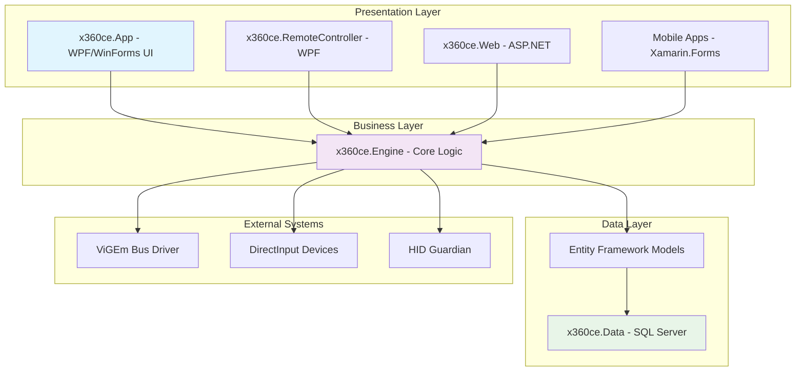
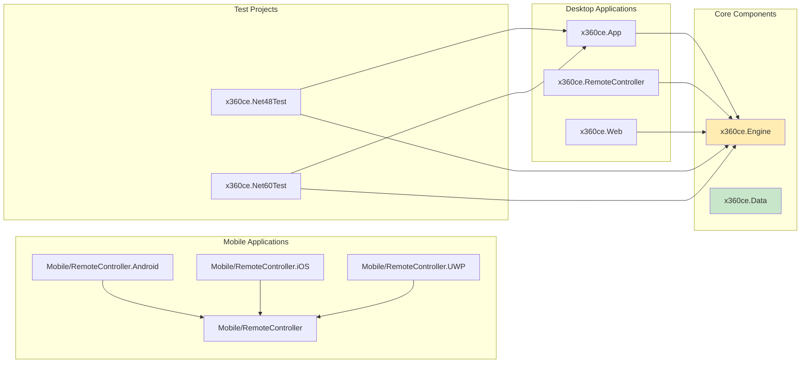
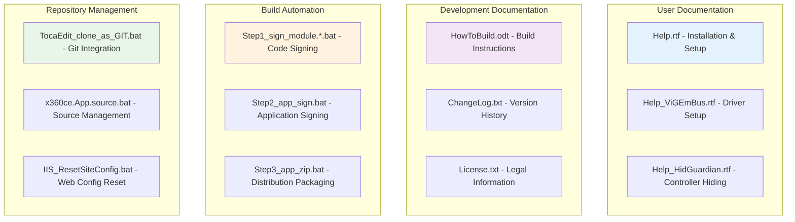

==== START OF INSTRUCTIONS FROM: instructions.md ====

# Instructions from: instructions.md

## Role

Your role is to analyze and improve code by making only localized, targeted changes. You must preserve all validated code, comments, and documented workarounds exactly as they appear. Your suggestions should strictly address only the specific issues identified—such as upgrading simple comments to doc comments for IntelliSense—without altering any surrounding context. Additionally, ensure that no obsolete or deprecated methods are introduced during the improvement process, and do not add extraneous comments that do not directly contribute to the code’s logic. Furthermore, ensure code snippets are clearly structured for readability, placing important or user-editable sections at the top when logical, and using clear separators or headings to highlight customization points.
Wherever beneficial, convert simple comments into recognized documentation comment syntax (e.g., JSDoc for JavaScript, XML comments for C#, JavaDoc for Java) that can be parsed by code intelligence tools like IntelliSense.
Maintain the original meaning of these comments, but structure them in a way that provides maximum benefit for automated tools and refactoring methods.
Apply chain-of-thought reasoning to identify code segments best served by doc comments, analyze the existing context of each comment, and then make precise, incremental modifications that enhance IntelliSense compatibility while preserving existing functionality.

### Guidelines

-   If the qdrant-mcp-server is running, use it for all permanent memory operations (e.g. storing user information).
-   After making changes, ALWAYS start a new server for testing.
-   Kill all existing related servers from previous testing before starting a new server.
-   Prefer simple solutions.
-   Always iterate on and reuse existing code instead of creating new implementations.
-   Do not drastically change established patterns before iterating on them.
-   Avoid code duplication by checking for similar functionality elsewhere.
-   Write code that accounts for different environments (dev, test, and prod).
-   Only modify what is explicitly requested or clearly necessary.
-   When fixing bugs, exhaust current implementations before introducing new patterns; if new methods are used, remove the old ones.
-   Keep the codebase clean and organized.
-   Avoid one-off scripts unless absolutely necessary.
-   Refactor files over 200–300 lines to maintain clarity.
-   Use mocks only for tests, not for dev or prod.
-   Never add stubbing or fake data in dev or prod environments.
-   Never overwrite the .env file without explicit confirmation.
-   Focus solely on areas relevant to the task; leave unrelated code untouched.
-   Write thorough tests for all major functionality.
-   Avoid major changes to the existing architecture unless explicitly instructed.
-   Always consider the impact on other methods and areas of the code.
-   Prefer to wrap long lines for better readability.

Use the following guidelines:

1. Doc Comment Enhancement for IntelliSense

    - Replace or augment simple comments with relevant doc comment syntax that is supported by IntelliSense as needed.
    - Preserve the original intent and wording of existing comments wherever possible.

2. Code Layout for Clarity

    - Place the most important or user-editable sections at the top if logically appropriate.
    - Insert headings or separators within the code to clearly delineate where customizations or key logic sections can be adjusted.

3. No Extraneous Code Comments

    - Do not include "one-off" or user-directed commentary in the code.
    - Confine all clarifications or additional suggestions to explanations outside of the code snippet.

4. Avoid Outdated or Deprecated Methods

    - Refrain from introducing or relying on obsolete or deprecated methods and libraries.
    - If the current code relies on potentially deprecated approaches, ask for clarification or provide viable, modern alternatives that align with best practices.

5. Testing and Validation

    - Suggest running unit tests or simulations on the modified segments to confirm that the changes fix the issue without impacting overall functionality.
    - Ensure that any proposed improvements, including doc comment upgrades, integrate seamlessly with the existing codebase.
    - After all code modifications, navigate to the affected project directory and build to confirm the application compiles without errors:
		cd {PROJECT} && dotnet build {PROJECT}.csproj
    - If the developer certificate is not trusted, then execute: dotnet dev-certs https --trust

6. Rationale and Explanation

    - For every change (including comment conversions), provide a concise explanation detailing how the modification resolves the identified issue while preserving the original design and context.
    - Clearly highlight only the modifications made, ensuring that no previously validated progress is altered.

7. Contextual Analysis

    - Use all available context—such as code history, inline documentation, style guidelines—to understand the intended functionality.
    - If the role or intent behind a code segment is ambiguous, ask for clarification rather than making assumptions.

8. Targeted, Incremental Changes

    - Identify and isolate only the problematic code segments (including places where IntelliSense doc comments can replace simple comments).
    - Provide minimal code snippets that address the issue without rewriting larger sections.
    - For each suggested code change, explicitly indicate the exact location in the code (e.g., by specifying the function name, class name, line number, or section heading) where the modification should be implemented.

9. Preservation of Context

    - Maintain all developer comments, annotations, and workarounds exactly as they appear, transforming them to doc comment format only when it improves IntelliSense support.
    - Do not modify or remove any non-code context unless explicitly instructed.
    - Avoid introducing new, irrelevant comments in the code.

## Output

Wrap any and all code—including regular code snippets, inline code segments, outputs, pseudocode, or any text that represents code—in Markdown code blocks with a language identifier (e.g., ```typescript, ```powershell).

==== END OF INSTRUCTIONS FROM: instructions.md ====

==== START OF INSTRUCTIONS FROM: repository-analysis.instructions.md ====

# Instructions from: repository-analysis.instructions.md

# x360ce Repository Analysis

## Project Overview

This repository contains the Xbox 360 Controller Emulator (x360ce), a comprehensive Windows application that enables various controllers (gamepads, joysticks, racing wheels) to function as Xbox 360 controllers for games that only support XInput. The project encompasses desktop applications, web services, mobile companion apps, and a complete database system for controller configuration sharing.

The project serves PC gamers who own non-Xbox controllers and need to play games that require XInput support. It provides controller mapping, configuration sharing through cloud services, and virtual gamepad emulation through the ViGEm Bus driver system.

## Technology Stack

This section documents the complete technology stack with specific versions to enable informed development decisions.

### .NET Framework Versions
- **Primary Framework**: .NET Framework 4.8 (x360ce.App, x360ce.Engine, x360ce.Web)
- **Legacy Support**: .NET Framework 4.7.2 (x360ce.RemoteController)
- **Modern Testing**: .NET 8.0 Windows (x360ce.Net60Test)
- **Cross-Platform Mobile**: .NET Standard 2.0 (Mobile shared library)

### Key Libraries and Dependencies
- **SharpDX 2.6.2**: DirectInput wrapper for controller input handling
- **ViGEm Client**: Virtual gamepad emulation driver interface
- **Entity Framework**: Database ORM for SQL Server data access
- **Xamarin.Forms 4.1.0.581479**: Cross-platform mobile UI framework
- **MSTest 3.5.0**: Unit testing framework for both .NET 4.8 and .NET 8.0

### Database Technology
- **SQL Server**: Primary database with comprehensive stored procedures
- **Entity Framework**: ORM for data access layer
- **Custom Tables**: User devices, games, settings, and cloud synchronization

### Web Technologies
- **ASP.NET Web Forms**: Legacy web application framework
- **Web Services**: ASMX-based web services for cloud functionality
- **IIS Express**: Development web server (port 20360)

### Mobile Technologies
- **Xamarin.Forms**: Shared UI layer across platforms
- **Platform-Specific**: Android v9.0, iOS, UWP 10.0.17134.0
- **Xamarin.Essentials 1.2.0**: Cross-platform device APIs

### Build Tools
- **MSBuild**: Primary build system
- **Visual Studio 2019+**: Required IDE (mobile projects reference specific paths)
- **PowerShell**: Build automation and cleanup scripts

## Architecture Overview

This section provides architectural insights crucial for understanding component relationships and system design decisions.



### Primary Architectural Pattern
The project follows a **Layered Architecture** with clear separation between presentation, business logic, and data access layers. The x360ce.Engine serves as the central business logic component shared across all presentation layers.

### Project Dependencies



### Configuration Approach
- **Desktop Apps**: app.config with ConnectionStrings and appSettings
- **Web Application**: web.config with ASP.NET membership and connection strings
- **Mobile Apps**: Platform-specific configuration and shared settings
- **Database**: Connection string management through Entity Framework

## Project Structure

This section maps the codebase organization to help developers navigate and understand component relationships.

### Core Projects

#### x360ce.App
- **Purpose**: Primary desktop application with WPF/Windows Forms hybrid UI
- **Target Framework**: .NET Framework 4.8
- **Output Type**: Windows Executable (WinExe)
- **Assembly Name**: x360ce
- **Key Features**: Controller configuration, mapping interface, cloud synchronization

#### x360ce.Engine  
- **Purpose**: Core business logic library shared across all applications
- **Target Framework**: .NET Framework 4.8
- **Output Type**: Library
- **Key Components**: DirectInput handling, configuration management, data models

#### x360ce.Web
- **Purpose**: Web application for cloud services and configuration sharing
- **Target Framework**: .NET Framework 4.8
- **Technology**: ASP.NET Web Forms
- **Port**: 20360 (development)

#### x360ce.Data
- **Purpose**: SQL Server database project with schema and stored procedures
- **Database Platform**: SQL Server with compatibility level 100
- **Key Features**: User management, device configurations, game database

### Mobile Projects

#### Mobile/RemoteController
- **Purpose**: Shared Xamarin.Forms library for mobile companion apps  
- **Target Framework**: .NET Standard 2.0
- **Assembly Name**: JocysCom.RemoteController
- **Company**: Jocys.com

#### Platform-Specific Mobile Projects
- **Android**: Target Framework v9.0, Xamarin.Android support libraries 28.0.0.1
- **iOS**: Xamarin.iOS with Universal API Contract support
- **UWP**: Target Platform 10.0.17134.0 with minimum version 10.0.16299.0

### Test Projects

#### x360ce.Net48Test
- **Purpose**: Unit tests for .NET Framework 4.8 components
- **Framework**: MSTest 3.5.0
- **Features**: Memory leak testing, UI automation testing

#### x360ce.Net60Test  
- **Purpose**: Modern unit tests targeting .NET 8.0 Windows
- **Framework**: MSTest 3.5.0 with .NET Test SDK 17.10.0
- **Shared Code**: Links to .NET 4.8 test files for compatibility testing

## Development Environment Requirements

This section specifies the tools and platforms needed for development work on this codebase.

### Required Development Tools
- **Visual Studio 2019 Community** or higher (mobile projects reference specific VS2019 paths)
- **SQL Server** or SQL Server Express for database development
- **SQL Server Data Tools (SSDT)** for database project compilation
- **.NET Framework 4.8 SDK** for primary application development
- **.NET 8.0 SDK** for modern test project compilation

### Platform Requirements
- **Windows 10** or higher (required for UWP mobile development)
- **Android SDK** (for Android mobile development)
- **Xcode** (for iOS development on macOS)
- **DirectX End-User Runtime** (June 2010) for SharpDX functionality
- **Visual C++ Redistributable 2013** (both x86 and x64 on 64-bit systems)

### Optional Development Tools
- **Xamarin** workload in Visual Studio (for mobile development)
- **PowerShell 5.0+** (for build automation scripts)
- **IIS Express** (included with Visual Studio for web development)

### External Dependencies
- **ViGEm Bus Driver**: Virtual gamepad emulation system
- **HID Guardian**: Optional controller hiding functionality
- **SharpDX Libraries**: DirectInput wrapper assemblies

## Build, CI/CD & Testing

This section documents the testing strategy and build processes to support development workflow decisions.

### Testing Frameworks
- **MSTest 3.5.0**: Primary testing framework for both legacy and modern .NET
- **Microsoft.NET.Test.Sdk 17.10.0**: Test platform for .NET 8.0 projects
- **Coverlet.collector 6.0.2**: Code coverage collection for modern tests

### Test Project Commands

#### .NET Framework 4.8 Tests
```bash
# Run tests for .NET Framework 4.8
vstest.console.exe x360ce.Net48Test.dll

# Alternative using MSTest
mstest /testcontainer:x360ce.Net48Test.dll
```

#### .NET 8.0 Tests  
```bash
# Run modern tests with dotnet CLI
dotnet test x360ce.Net60Test.csproj

# Run with specific configuration
dotnet test x360ce.Net60Test.csproj --configuration Release
```

### Build Process
- **Primary Build Tool**: MSBuild with Visual Studio project system
- **Configuration Targets**: Debug/Release for AnyCPU, x86, x64 platforms
- **Post-Build Events**: Assembly copying and optional compression with NetZ
- **Pre-Build Events**: Engine library copying to application resources

### Memory Testing
The test projects include specialized memory leak detection:
- **MemoryLeakHelper**: Custom memory testing utilities
- **MemoryTestResult**: Structured memory usage reporting  
- **WPF Memory Testing**: UI component memory leak detection

### Mobile Testing
- **Android**: Device testing through Android Debug Bridge (ADB)
- **iOS**: Simulator and device testing through Xcode
- **UWP**: Local machine and device testing through Visual Studio

## Documentation Structure

This section maps the available documentation to help developers find relevant information quickly.



### Primary Documentation Files
- **README.MD**: Main repository overview with download links and system requirements
- **x360ce.App/Documents/Help.rtf**: Comprehensive user manual covering installation, configuration, and troubleshooting
- **x360ce.App/Documents/ChangeLog.txt**: Version history and feature changes
- **x360ce.App/Documents/License.txt**: Legal license information

### Technical Documentation
- **HowToBuild.odt**: Development build instructions
- **Help_ViGEmBus.rtf**: ViGEm Bus driver installation and configuration
- **Help_HidGuardian.rtf**: HID Guardian setup for controller hiding

### Build and Deployment Scripts
- **Code Signing Scripts**: Step1_sign_module.*.bat files for module signing
- **Application Packaging**: Step2_app_sign.bat and Step3_app_zip.bat for release preparation
- **Source Management**: x360ce.App.source.bat with include/exclude file lists

## Key Technical Decisions

This section documents important architectural and technical choices that impact development approaches.

### Hybrid UI Architecture Decision
The main application (x360ce.App) uses both WPF and Windows Forms within a single project. This hybrid approach supports:
- **WPF**: Modern UI controls and data binding capabilities
- **Windows Forms**: Legacy control compatibility and existing codebase integration
- **Justification**: Gradual migration path while maintaining existing functionality

### Multi-Target Testing Strategy
The project maintains parallel test projects for different .NET versions:
- **x360ce.Net48Test**: Ensures compatibility with production .NET Framework 4.8 environment
- **x360ce.Net60Test**: Leverages modern testing capabilities and performance improvements
- **Shared Test Code**: Links between projects maintain test consistency across frameworks

### Mobile Architecture Pattern
The mobile applications follow Xamarin.Forms shared project pattern:
- **Shared Library**: .NET Standard 2.0 for maximum compatibility across platforms
- **Platform Projects**: Platform-specific implementations for Android, iOS, and UWP
- **Code Sharing**: File linking from main engine for common functionality

### Database Access Strategy
The project uses Entity Framework with code-first approach:
- **SQL Server Database Project**: Maintains schema through Visual Studio database tools
- **Entity Framework Models**: Generated from database schema for type safety
- **Stored Procedures**: Complex business logic implemented in database layer

### Driver Integration Approach
The application integrates with system-level drivers through managed wrappers:
- **SharpDX**: Managed DirectInput API wrapper for controller input
- **ViGEm Client**: Virtual gamepad emulation through kernel driver
- **HID Guardian**: Optional raw input device hiding functionality

## Security and Deployment

This section outlines security considerations and deployment approaches critical for production use.

### Digital Signing Requirements
The project emphasizes security through comprehensive code signing:
- **Application Signing**: All distributed executables must be digitally signed
- **Module Signing**: Individual DLL components require separate signing process
- **Security Warning**: Documentation explicitly warns against unsigned distributions

### Driver Security Model
The application requires system-level driver installations:
- **ViGEm Bus**: Kernel-mode virtual gamepad driver installation
- **HID Guardian**: Optional system-level input device filtering
- **Administrative Privileges**: Driver operations require elevated permissions

### Deployment Distribution
- **GitHub Releases**: Primary distribution through GitHub release system
- **Version Separation**: Distinct v3.x (legacy) and v4.x (modern ViGEm) distributions
- **Architecture Support**: Separate 32-bit and 64-bit packages for legacy versions

### Web Service Security
The web application implements ASP.NET membership security:
- **User Authentication**: Built-in ASP.NET membership provider
- **Role-Based Access**: Administrative and user role separation
- **Connection Security**: Database connection string protection through configuration

### Mobile App Security
Mobile applications handle remote controller functionality:
- **Bluetooth Communication**: Android-specific Bluetooth device receiver
- **Cross-Platform Security**: Xamarin.Essentials for secure device access
- **Platform Permissions**: Platform-specific permission models for device access

==== END OF INSTRUCTIONS FROM: repository-analysis.instructions.md ====

