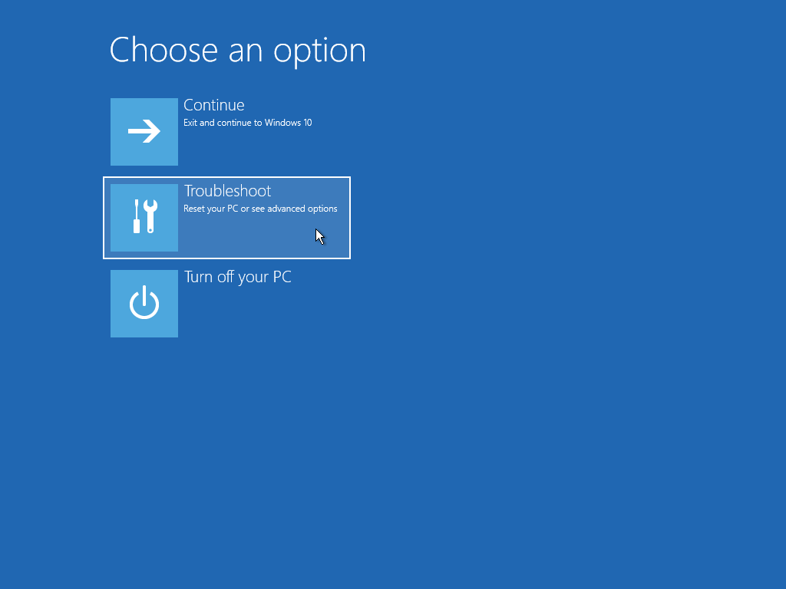
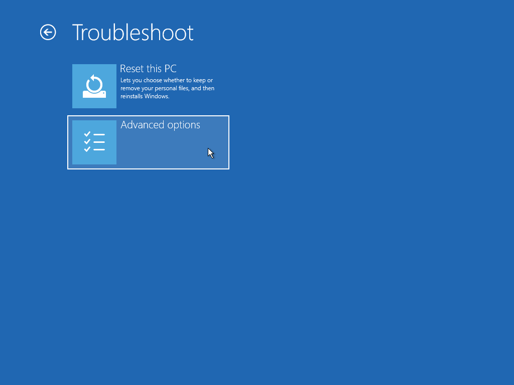
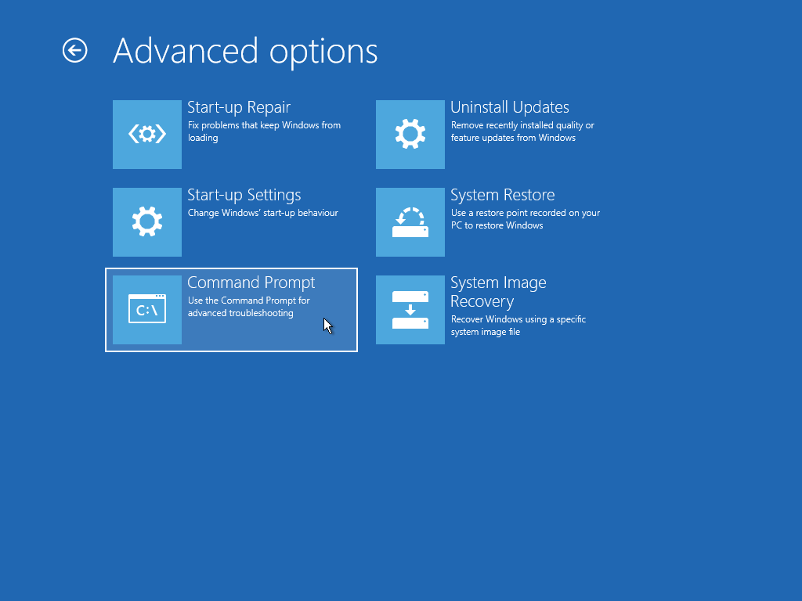
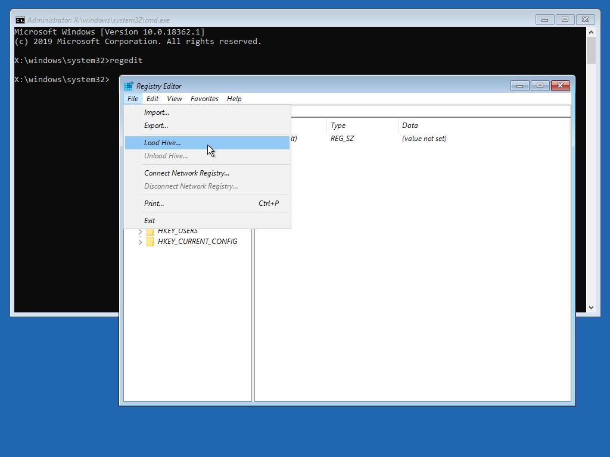
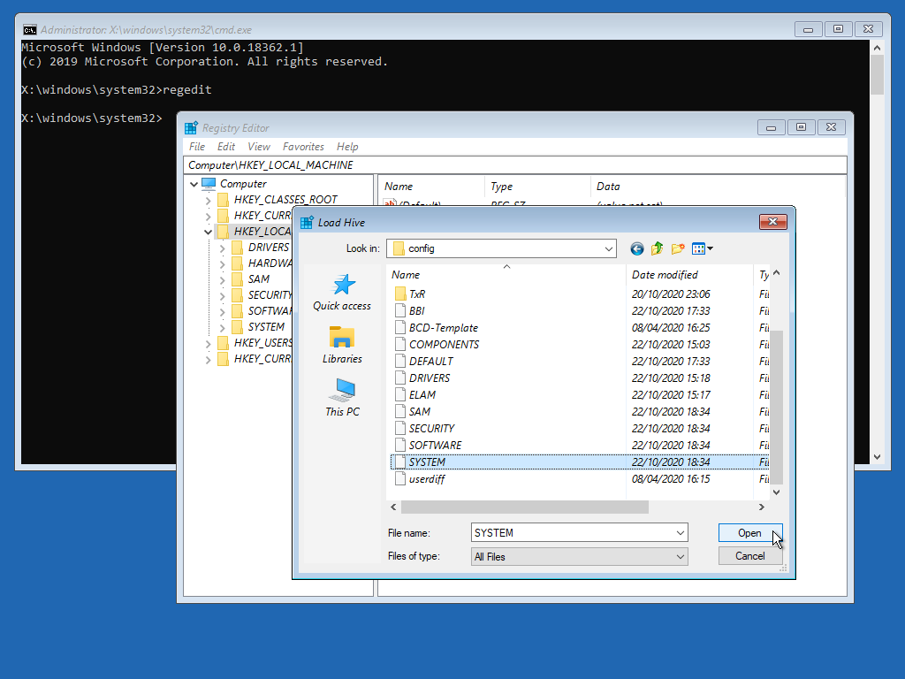
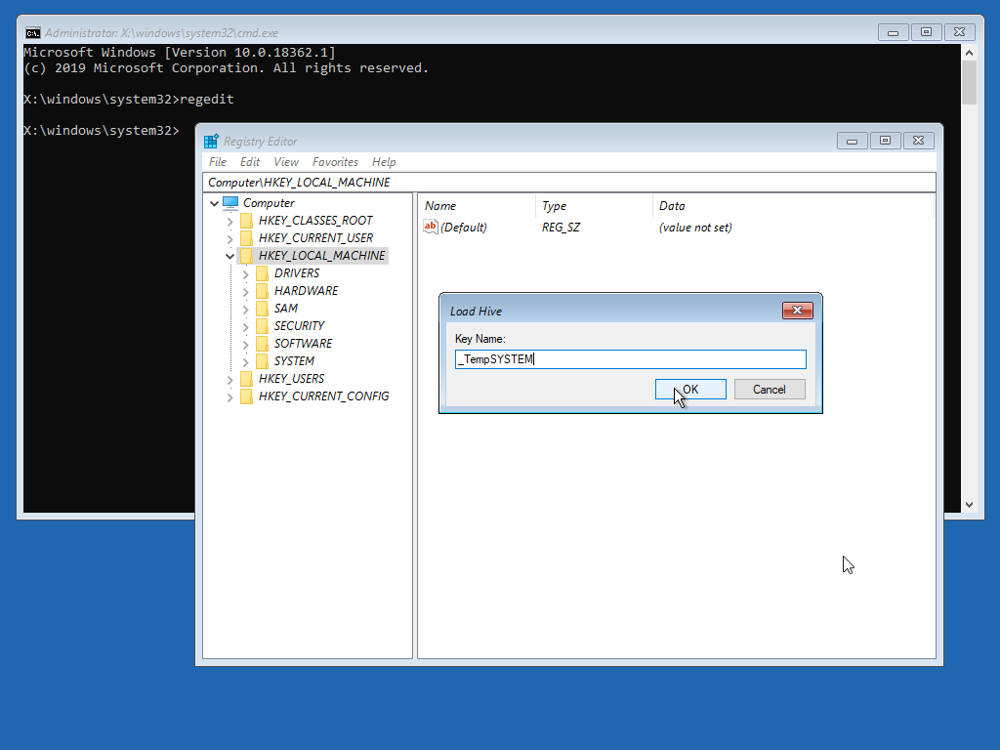
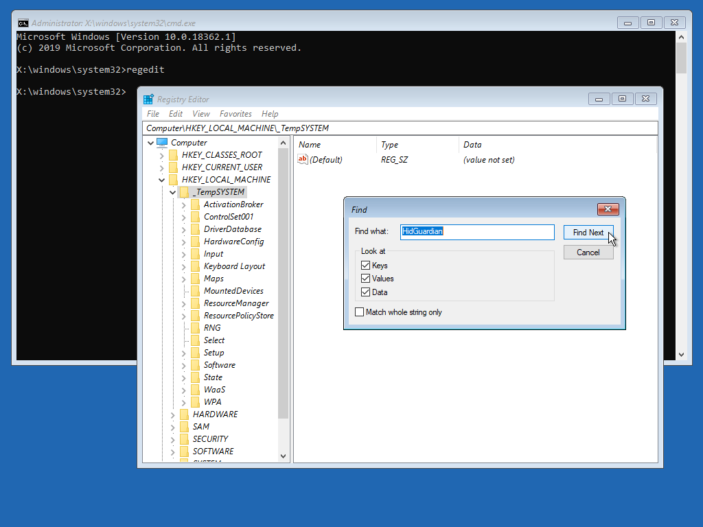
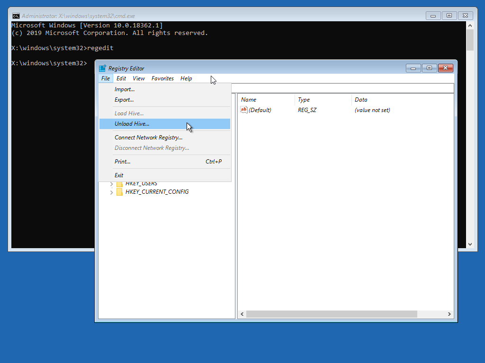

# HID Guardian

**HID Guardian is obsolete. Use HID Hide to hide the real controller from games.**

`HID Guardian` hid original controllers from games, so that only virtual controllers were visible. Its author stopped it in 2023 and `HID Hide` replaced it: `[Options]` tab → `[HID Hide]` tab. This version only removes `HID Guardian`.

- Install: not supported by this version. The installer is disabled for safety, because a misconfigured HID filter driver can lock out keyboard and mouse. Only uninstall is available.
- Uninstall order: the HID class filter is removed first and checked, and the driver is removed only after the filter is confirmed gone. If the filter cannot be removed, the driver is left in place, because a filter naming a missing driver is what stops keyboard and mouse from working.
- Recovery: if HID devices stop working, run `HidGuardian_Remove.ps1` from an administrative command prompt, in safe mode if needed. The script is extracted to `C:\Program Files\ViGEm HidGuardian` and clears every HID Guardian registry entry, including the class filter.
- Uninstall: `[Options]` tab → `[HID Guardian (obsolete)]` tab → `[Uninstall]` button.

**DO NOT** attempt to remove `HID Guardian` by simply deleting it from Windows OS `Device Manager`. This can result in **losing access** to your `Mouse` and `Keyboard` and you will be forced to follow Manual Uninstall Instructions below.

## How to Uninstall HID Guardian When Access to Keyboard and Mouse is Lost

These steps delete HID Guardian's entries from the registry of the Windows that lost its keyboard and mouse, working from the Windows recovery environment, where both still work.

1. Boot into the Advanced Boot Menu and choose `[Troubleshoot]` → `[Advanced options]` → `[Command Prompt]`.

   

   

   

2. When the black command prompt window opens, type `regedit` and press `Enter`.
3. In `Registry Editor`, click the `HKEY_LOCAL_MACHINE` key.
4. Choose `[File]` → `[Load Hive...]`.

   

5. Go to `D:\Windows\System32\config` and select the file named `SYSTEM`, which has no extension. The Windows drive can have another letter here than `D:`. To keep a backup, copy the `SYSTEM` file somewhere else first. The file can also be loaded and fixed this way on another computer.

   

6. Click `[Open]`, enter `_TempSYSTEM` as the key name and click `[OK]`.

   

7. Click the `_TempSYSTEM` key.
8. Press `Ctrl+F` and search for `HidGuardian`.

   

9. When the search finds it, check that the key is HID Guardian's, then right-click it and choose `Delete`. Delete the whole key, not just its values.
10. Search again, and repeat until no key or value named `HidGuardian` is found.
11. Click the `_TempSYSTEM` key and choose `[File]` → `[Unload Hive...]`.

   

12. Close `Registry Editor` and the command prompt window, restart, and check that Windows finds the keyboard and mouse again.
