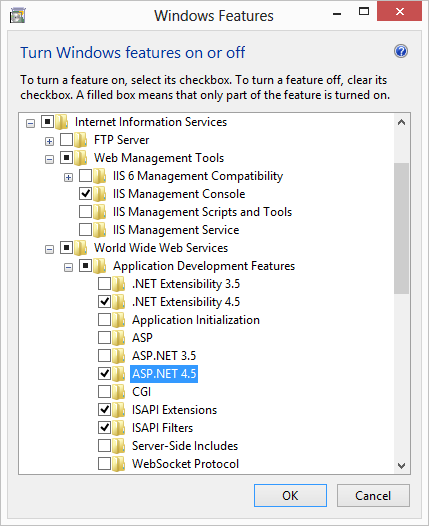
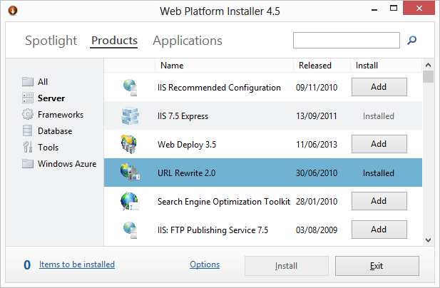
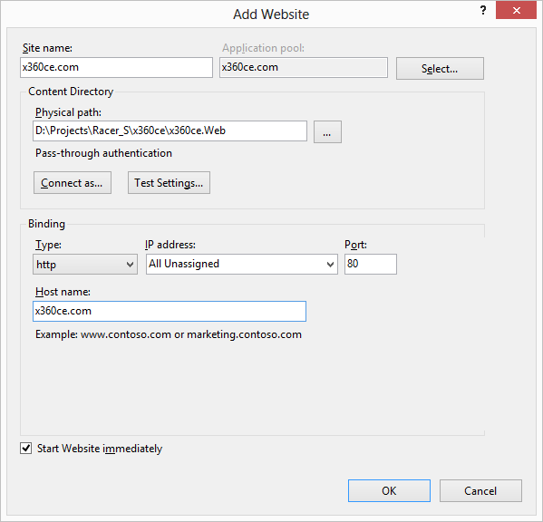
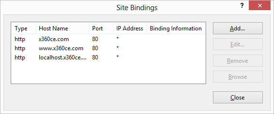
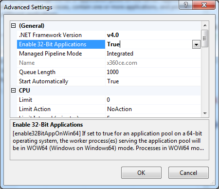

# How to set up the x360ce website

Shared by both application versions. This describes hosting the **website**, not building the
application — the page name says otherwise and is wrong.

## Install IIS

Control Panel > Programs and Features > Turn Windows features on

Check:

- [v] Internet Information Services

Make sure that these options are also checked:

- [v] .NET Extensibility 4.5
- [v] ASP.NET 4.5
- [v] ISAPI Extensions
- [v] ISAPI Filters



## Install URL Rewrite Module

Go to: <http://www.microsoft.com/web/downloads/platform.aspx>

Download and launch: Microsoft Web Platform Installer 4.5

Install `Server\URL Rewrite 2.0 Module`:



To configure IIS to log rewritten URLs into its log files, instead of logging the original URLs requested by the HTTP client, run the following command from an elevated command prompt:

```
reg add HKEY_LOCAL_MACHINE\SOFTWARE\Microsoft\InetStp\Rewrite /v LogRewrittenUrl /t REG_DWORD /d 1
```

and

```
iisreset
```

Check help: <http://learn.iis.net/page.aspx/517/url-rewriting-for-aspnet-web-forms/>

You can repair a URL Rewrite installation by using the manual installers:
<http://www.iis.net/downloads/microsoft/url-rewrite#additionalDownloads>

## URL Rewrite intellisense for Visual Studio

```
Racer_S\x360ce\x360ce.Web\Resources\Rewrite_Intellisense_VS2012\Install.bat
```

## Configure Web Site

Control Panel > Administrative Tools:

1. Open Computer Management: `Services and Applications\Internet Information Services`
2. Expand the `[Computer]` name on the other side and select the `Sites` node
3. Add Website...

Point `Physical path` to the `x360ce.Web` folder on your computer:



Select the `x360ce.com` website and update `Bindings...` by adding the `www.x360ce.com` and `localhost.x360ce.com` names:



`localhost.x360ce.com` will be pointed to the `127.0.0.1` IP address by default.

## Update Microsoft .NET 4.0 on IIS

1. Run the command prompt as administrator
2. Type the line in the command prompt below

On 32-bit Windows:

```
%windir%\Microsoft.NET\Framework\v4.0.30319\aspnet_regiis.exe -i
```

On 64-bit Windows:

```
%windir%\Microsoft.NET\Framework64\v4.0.30319\aspnet_regiis.exe -i
```

## Enable 32-bit Applications

Control Panel > Administrative Tools:

1. Open Computer Management: `Services and Applications\Internet Information Services`
2. Expand the `[Computer]` name on the other side and select the `Application Pools` node
3. Select the `x360ce.com` application pool on the right side
4. Edit Advanced Settings...
5. Set `Enable 32-Bit Applications` to: `true`



## Unlock web.config modules and handlers

IIS implements "Configuration Locking". This is to help with IIS administration. The IIS Administrator can lock down Configuration Sections, Section Elements and Attributes at the IIS level.

You have to unlock the `web.config` section by executing these two commands inside a Command Prompt with administrator rights:

```
%windir%\system32\inetsrv\appcmd.exe unlock config -section:system.webServer/handlers
%windir%\system32\inetsrv\appcmd.exe unlock config -section:system.webServer/modules
```

## Fix SQL Login after restoring database

Run this SQL stored procedure after restoring the database from backup:

```sql
USE [x360ce]
GO
-- This command will create and fix missing SQL Server Login and Database User.
-- You can change the 'localdev' password to something else.
EXEC [dbo].[Tools_FixUser] 'x360ceAdmin', 'localdev', 1
```

## How to Open *.SQLPROJ Projects

If your Visual Studio can't open `*.sqlproj` projects then you don't have "Microsoft SQL Server Data Tools" installed. Go here and download them for your version of Visual Studio:
<http://msdn.microsoft.com/en-us/data/tools.aspx>

You can download these tools as an ISO image (~1.7 GB).
